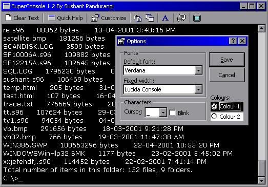



## SuperConsole: Complete DOS\-like console in VB \(new 26 APR\)

### Description

This is a complete console with loads of features: 1. You can open and run any file in the directory 2. There is a set of commands for network operations, ping, whois, ip, hostname, port, etc. 3. There is an in-built image and text file viewer. It functions as a complete DOS console. There are functions for standard operations: cls, md, cd, name, del, list, etc. You can list all files in the current directory, there is a completely customizable interface. UPDATED Apr 23. Now you can delete, copy and move multiple files using windows' wildcards like *.* etc. COMPLETE FULLSCREEN MODE. There is support for reading text files and parsing their contents, like an MS-DOS batch file. One more update (same day evening): Added Pause and Echo functions, and complete DOCUMENTATION. *LATEST: NO FLICKERING!* Have a look at the screenshot and decide if its worth a vote!
 
### More Info
 

             |
---                |---
**Submitted On**   |2001-04-26 11:47:18
**By**             |[sushpa](https://github.com/Planet-Source-Code/PSCIndex/blob/master/ByAuthor/sushpa.md)
**Level**          |Advanced
**User Rating**    |4.4 (40 globes from 9 users)
**Compatibility**  |VB 5\.0, VB 6\.0
**Category**       |[Complete Applications](https://github.com/Planet-Source-Code/PSCIndex/blob/master/ByCategory/complete-applications__1-27.md)
**World**          |[Visual Basic](https://github.com/Planet-Source-Code/PSCIndex/blob/master/ByWorld/visual-basic.md)
**Archive File**   |[SuperConso188634272001\.zip](https://github.com/Planet-Source-Code/sushpa-superconsole-complete-dos-like-console-in-vb-new-26-apr__1-22600/archive/master.zip)

